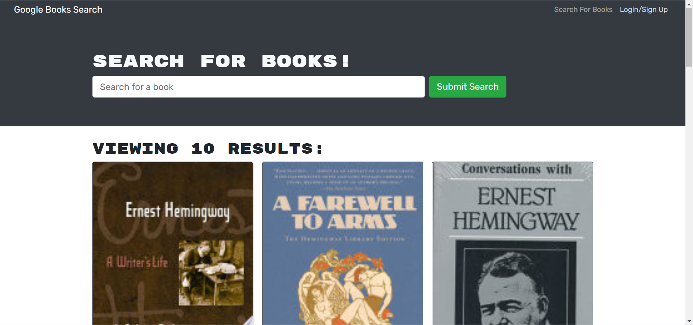

# Book Search Engine
  

[Visit Site](https://warm-river-89849.herokuapp.com/)

## Description

A full-stack MERN app that allows users to search Google's book database by title. Users can sign up to save books to a collection that they can view later.

## Table of Contents
  * [Installation](#installation)
  * [Usage](#usage)
  * [License](#license)
  * [Contributing](#contributing)
  * [Testing](#testing)
  * [Questions](#questions)

## Installation
  Clone project to your directory and install dependencies. Run npm start to launch server on localhost port 3000.

## Usage
  Enter the title of the book in the search bar to see information about the book and a link to the book on Google Books. New uses sign up in order to use the book save feature and them to your collection. To view the collection click the See Your Books button in the navigation section.

## License 
  This project is covered under the MIT license.

## Contributing
  Contact me with the details below in order to contribute.

## Testing
  Coming soon

## Questions
  Visit me at GitHub  
  [ZachWagner1](https://github.com/ZachWagner1)

  Comments or questions? Email me at:
  [zwag14@yahoo.com](mailto:zwag14@yahoo.com)
